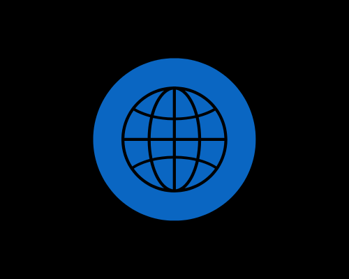

  
  

**Étudiant à 42**\

---

### 🛠️ Stack Technique

**Bas Niveau & Système**

**IA & Python**

**Web & Mobile (Expertise MMI)**

---

## Projets Phares

### Intelligence Artificielle & Algorithmique
*   **AI Integration (Qwen & vLLM):** Réalisation de **RAG** et de **Constrained Decoding** pour structurer les réponses de LLMs.
*   **Labyrinthe & Graphes:** Générateur et solveur de labyrinthes avec rendu 2D (**MiniLibX**) et visualisation et résolution de graphes interactive (**Pygame**).
*   **Pac-Man Procedural:** Clone de Pac-Man avec génération de map aléatoire et double moteur de rendu **2D et 3D**.

### Programmation Système (C)
*   **Codexion:** Multi-threading (threads, mutex, synchronisation).
*   **ft_printf:** Recodage complet de la fonction printf de la libc.
*   **get_next_line:** Lecture optimisée ligne par ligne via un descripteur de fichier.

### Web & Expériences
*   **Applications Fullstack:** Développement de sites de rencontre, plateformes culinaires et intégration de scènes **3D (Three.js)**.
*   **Frameworks:** Maîtrise de l'écosystème React, React Native, Vue et Laravel...
